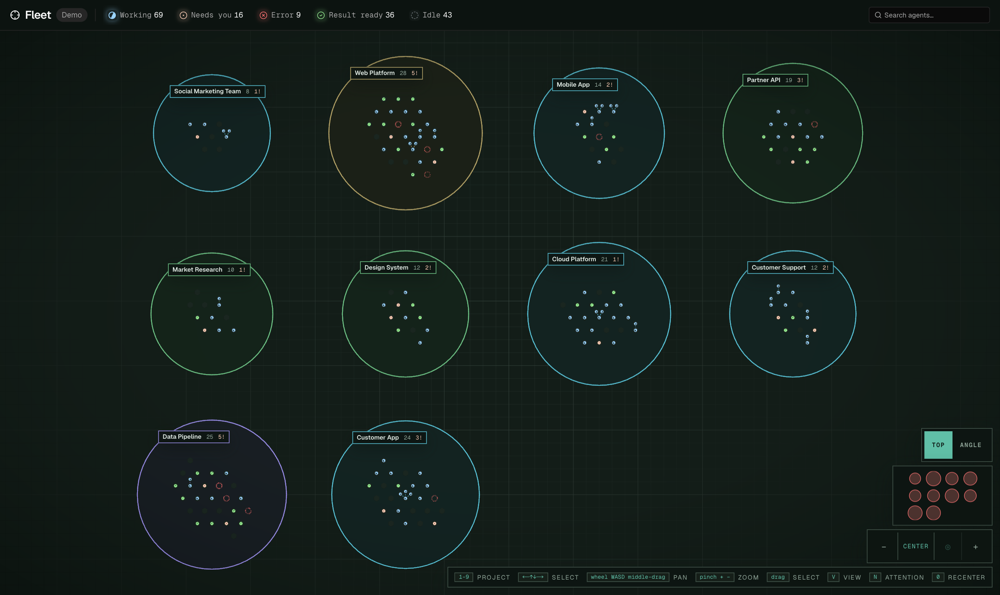
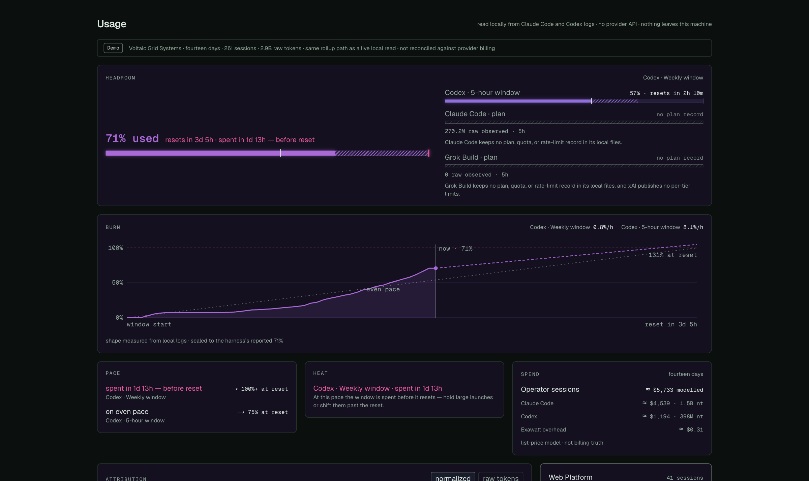

<!-- Generated for the public repository by the "public-document-set" recipe. -->
<div align="center">


<h1>Exawatt</h1>

<p>
  <b>Command many agents at once.</b>
  <br />
  See what each one is doing, what it needs from you, and what it costs.
</p>

<p>
  <a href="https://exawatt.ai">Website</a>
  &nbsp;&nbsp;·&nbsp;&nbsp;
  <a href="#try-it-without-installing-anything">Demo Mode</a>
  &nbsp;&nbsp;·&nbsp;&nbsp;
  <a href="docs/engineering/roadmap.md">Roadmap</a>
  &nbsp;&nbsp;·&nbsp;&nbsp;
  <a href="CONTRIBUTING.md">Contributing</a>
  &nbsp;&nbsp;·&nbsp;&nbsp;
  <a href="LICENSING.md">Licensing</a>
</p>

<p>
  
  
</p>



<p><sub>173 agents across ten projects, marketing and research beside the code. Sixteen need an answer from you.</sub></p>



<p><sub>What the work cost, read from local harness logs. No provider API, nothing leaves the machine.</sub></p>

<p><sub>Both shots are Demo Mode, the synthetic workspace that ships with this repository.</sub></p>

</div>

Claude Code, Codex, OpenClaw and other harnesses each give you one agent in one
terminal. Exawatt is the surface above them: every session in one place, with
truthful status, so you can run ten without losing track of any.

Coding is the first thing most people point a fleet at, and it is not the
boundary. The same surface commands research, writing, operations, and anything
else a compatible agent can do.

## What it does

- **Runs agents in parallel.** Launch a session on any configured harness, keep
  them all visible, and switch without rebuilding context in your head.
- **Tells you the truth about status.** Working, needs you, done. A green light
  means the agent is actually working, not that a process is alive.
- **Shows what work costs.** Tokens, time, and consumption per session and per
  project, measured rather than estimated.
- **Runs on your machine.** Agents are local processes using your own harness
  logins. Exawatt does not resell inference and does not need a token balance.

## Try it without installing anything

Demo Mode runs the whole interface against a synthetic workspace, with no
account, no agents, and no network:

```bash
pnpm install
pnpm dev
```

Open http://localhost:7000 and pick Demo Mode. Everything you see is authored
sample data, and it is labeled as such wherever it appears.

## Build the desktop app

```bash
pnpm install
pnpm electron:build:dir
```

Requires macOS on Apple silicon and Node 22. This produces a community build:
it talks to no Exawatt service, carries no analytics, and has no update
channel. It runs Demo Mode and any agent harness you have installed locally.

Official signed builds come from exawatt.ai and are a separate distribution.
See [LICENSING.md](LICENSING.md) for what that distinction means.

## Status

macOS only today. It is used daily by its author to run real work, and it moves
fast. The [roadmap](docs/engineering/roadmap.md) is the real one, kept in the
repository, and it says what is planned and what is deliberately not.

## Contributing

Read [CONTRIBUTING.md](CONTRIBUTING.md) first. The short version: open an issue
before a large change, adapters and harness support are the most useful place to
start, and the design system and product vocabulary are owned rather than open.

Exawatt is AGPL-3.0-or-later. The compatibility specification under
`contracts/` is Apache-2.0 so other tools can adopt it freely.
