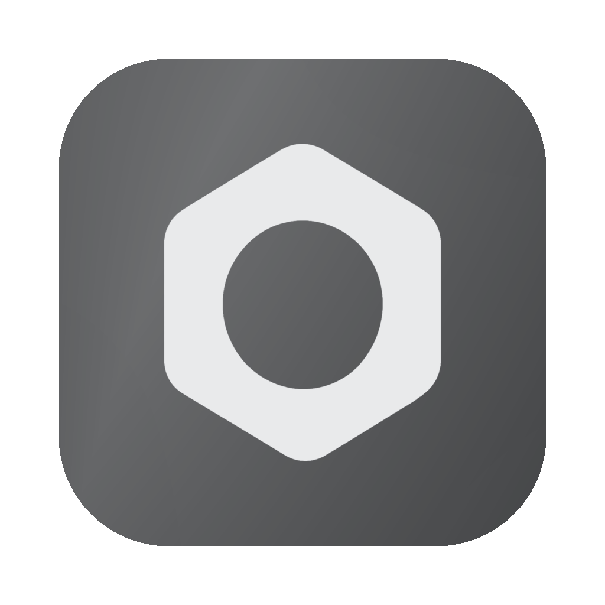

<!-- Generated for the public repository by the "public-document-set" recipe. -->
<div align="center">



<h1>Exawatt</h1>

<p>
  <b>Command many agents at once.</b>
  <br />
  See what each one is doing, what it needs from you, and what it costs.
</p>

<p>
  <a href="https://exawatt.ai/download">Download for Mac</a>
  &nbsp;&nbsp;·&nbsp;&nbsp;
  <a href="#run-it-without-installing-anything">Demo Mode</a>
  &nbsp;&nbsp;·&nbsp;&nbsp;
  <a href="docs/engineering/roadmap.md">Roadmap</a>
  &nbsp;&nbsp;·&nbsp;&nbsp;
  <a href="CONTRIBUTING.md">Contributing</a>
  &nbsp;&nbsp;·&nbsp;&nbsp;
  <a href="LICENSING.md">Licensing</a>
</p>

<p>
  
  
</p>


<p><sub>173 agents across ten projects, marketing and research beside the code. Sixteen need an answer from you.</sub></p>


<p><sub>What the work cost, measured from the session logs your harnesses already keep on disk.</sub></p>

<p><sub>Both shots are Demo Mode, the synthetic workspace that ships with this repository.</sub></p>

</div>

Claude Code, Codex, OpenCode and Grok Build each give you one agent in one
terminal. Exawatt is the surface above them: every session on one board, so you
can run ten without losing track of any. OpenClaw lands next.

Coding is the first thing most people point a fleet at, and it is not the
boundary. The same surface commands research, writing, operations, and anything
else a compatible agent can do.

## What it does

- **Runs them in parallel.** Launch a session on any harness you have
  installed, keep them all on one board, and move between them without
  rebuilding context in your head.
- **Tells you the truth about status.** Working, needs you, done. A status
  changes because the agent's own output said so, never because a process is
  still alive.
- **Shows what the work cost.** Tokens, burn against the next reset, and
  modelled spend per session and per project, read from the session logs your
  harnesses already keep on disk. The spend figure is a list-price model, not
  your provider's bill.
- **Runs on your machine.** Agents are ordinary local processes, started under
  your account with the harness logins you already pay for. Exawatt does not
  resell inference and needs no token balance. It starts them with approvals
  and sandboxing off by default, so a fleet keeps moving instead of stopping on
  every step, and Ask first turns the harness protections back on per agent.

## Install

**[Download for Mac](https://exawatt.ai/download).** macOS 12 or later, Apple
silicon. That build is signed with Exawatt's Developer ID, notarized by Apple,
and applies updates when you restart rather than while you are working.

### Run it without installing anything

Demo Mode runs the whole interface against a synthetic workspace. No account,
no agents, no network.

```bash
pnpm install
pnpm dev
```

Then open `http://localhost:7000/fleet/spatial` and
`http://localhost:7000/usage`, which are the two screenshots above. Everything
there is authored sample data and says Demo wherever it appears. The terminal
surface is the one thing a browser cannot show, because its panes are bound to
real local processes; `pnpm electron:dev` runs the desktop app instead.

### Build the desktop app

```bash
pnpm install
pnpm electron:build:dir
```

macOS on Apple silicon, Node 22. The result is `Exawatt Community.app` under
`release/mac-arm64`. It talks to no Exawatt service, carries no analytics, and
has no update channel, and it runs Demo Mode plus any harness already installed
on the machine. Nobody signed it, not Apple and not Exawatt. The source it came
from is what vouches for it.

## Licensing

The application is **AGPL-3.0-or-later**. Fork it, run it, change it. If you
run a modified copy as a network service, the people using it get your source.

The compatibility specification in [`contracts/`](contracts/README.md) is
**Apache-2.0**, along with the [roadmap
convention](docs/product/reference/roadmap-convention.md) it publishes. That
half is permissive on purpose: anyone can write an agent source, a harness
adapter, or a rival command surface against those contracts without asking us,
and that includes people building a competitor to this app. An interface only
we can implement is not an interface.

[LICENSING.md](LICENSING.md) has the exact paths and the third-party notices.
[TRADEMARKS.md](TRADEMARKS.md) covers the one thing the license does not hand
over: the right to call a build official.

## Contributing

Read [CONTRIBUTING.md](CONTRIBUTING.md) first. Open an issue or a Discussion
before a large change. Harness adapters and Agent Sources are the most useful
place to start; the design system and the product vocabulary are owned rather
than open, and [GOVERNANCE.md](GOVERNANCE.md) says how a proposal becomes
roadmap work.

**Agent-written pull requests are welcome, and the person who opens one owns
it.** This app exists to command coding agents, so refusing their output here
would be strange. What we ask is what any maintainer asks of any author: name
the tools you used, say what they produced, and be able to explain the whole
diff. Disclosure is evidence, not a substitute for tests or understanding, and
a pull request its author cannot explain does not merge however green the
checks are.

Questions go to Discussions, reproducible defects to issues, and security
reports to [SECURITY.md](SECURITY.md).

## Status

macOS only. There is no Linux or Windows build and no date for one. It is
early, it moves fast, and its author runs his own working day through it, which
is why the [roadmap](docs/engineering/roadmap.md) lives in this repository and
says what is planned, what is in flight, and what is deliberately not being
built. Most of the commits under it are co-authored by an agent. Exawatt is
built by the fleet it commands.

Today you run 10 agents. Tomorrow you will run 10,000. Exawatt is being built
for the second number.
